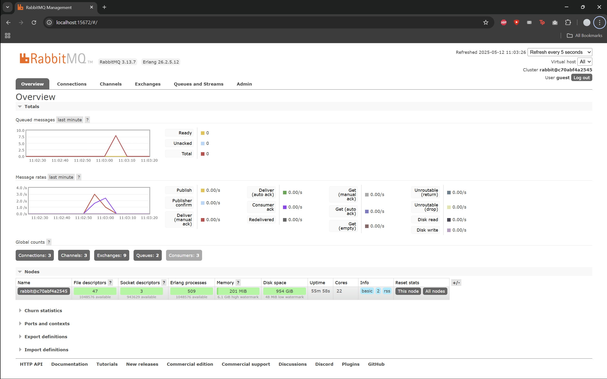

1) What is amqp?

    AMQP is an open standard that lets different applications reliably send and receive messages through a message broker

2) What does it mean? guest:guest@localhost:5672 , what is the first guest, and what is the second guest, and what is localhost:5672 is for? 
    
    The first guest is username, the second guest is that users password, localhost tells the code to connect to a broker running on your own machine, and 5672 is the default AMQP port that the broker listens on

- Simulation slow subscriber
    
    The total number of messages in the queue reached 26 on my machine. This happened because the producer was able to publish messages rapidly, while the subscriber was slow to process them. As a result, messages accumulated in the queue temporarily until the subscriber caught up and consumed them one by one.

- Reflection and Running at least three subscribers
    
    The queue briefly peaked at 9 messages, then quickly dropped to 0. This happened because the publisher sent multiple messages, but I used 3 subscribers, so the messages were processed in parallel. The queue drained faster compared to using only one subscriber, showing how adding more subscribers helps improve throughput and reduce backlog when the publisher is fast.

